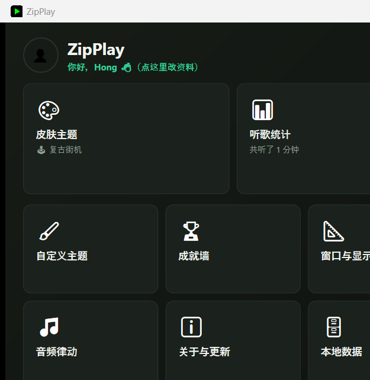

# ZipPlay

一个 Windows 桌面小型歌词播放器（歌词浮窗）。跟随系统当前正在播放的媒体（Spotify、网易云音乐、浏览器播放等，只要接入了 Windows 系统媒体控制 SMTC 的都支持），自动抓取并实时同步显示歌词，支持 22 套可切换的像素/复古风格皮肤（含自定义主题、1 套听歌成就解锁的限定皮肤），其中大部分皮肤会跟着正在播放的音乐响度/节奏实时变速、闪光、跳动。

首页 Hub 里还带了个人资料（昵称/头像）、听歌统计、成就墙、分享卡片这些——都是纯本地的，不联网、不登录，个人资料能导出成一个文件，换电脑/重装之后导进去就接着用。





## 下载安装

前往 [Releases](https://github.com/Hong005-byte/ZipPlay/releases) 页面下载最新的 `ZipPlay-Setup-x.x.x.exe`，双击安装即可（装在当前用户目录下，不需要管理员权限，不会弹 UAC）。安装完成后打开程序，每次启动都会自动检查有没有更新，右上角会提示新版本。

## 功能

- **像素开场动画**：启动时一个像素小人从右边把 `ZIPPLAY` 的像素字拖进画面中央，黑底橙金配色，点一下可以跳过。
- **首次启动问一次昵称/头像**：只在第一次打开时出现，填不填都行，纯本地展示用（听歌报告标题、分享卡片会用上），不是账号、不联网。之后从首页顶部的问候语随时能改。
- **首页 Hub**：开场动画之后是一个便当格首页，皮肤主题、听歌统计、成就墙、自定义主题、窗口与显示、音频律动、关于与更新、本地数据各占一格，点进去才看到具体内容，不用再从头滚到尾找设置项。
- **启动自动记住上次的选择**：只要本地已经选过一次（不是第一次打开），动画放完默认直接用上次的皮肤/尺寸/显示模式进播放器，不用每次都手动点"开始播放"。首页最下面有个勾选框可以关掉这个行为，改回"每次启动都先看首页"；改皮肤随时能从主播放器窗口右键菜单或者齿轮图标回去。
- **听歌统计 + 成就墙**：按天记录听了多久、听了哪些歌/艺人，纯本地不联网。本月/今年/全部时间三档切换，能一键导出一张分享卡片（PNG 图片）。7 个听歌相关成就点亮之后解锁第 8 个"尊贵皇冠"限定皮肤，专属配色，免费皮肤里挑不到。
  - **🔥 听歌热力图**：固定显示今年 1 月 1 日到今天，GitHub 贡献图那种"周为列、星期几为行"的格子摆位，颜色深浅对应当天听了多长时间（固定档位，不是相对当年最高的一天算比例），鼠标悬停能看具体某一天的时长。不跟着本月/今年/全部时间那三个切换按钮走，是独立的固定范围。
  - **✨ 亮点回顾**：统计页里点一下，同一份统计数据换成"一张卡片说一件事、点下一张翻页"的呈现——封面总时长、活跃天数、最常听的艺人/歌曲、最投入的一天、听过的艺人歌曲数，各自数据不够就跳过那一张，不硬凑。
- **🖼️ 歌词分享卡片**：主播放器右键菜单里能把正在显示的这一句歌词截成一张图片（PNG），配色跟着当前皮肤走，发朋友圈/群里方便，没到第一句歌词（比如刚切歌还在抓词）会提示一句，不会截出一张空卡片。
- **个人资料导出/导入**：昵称、头像、听歌记录能打包成一个 JSON 文件，换电脑或者重装之后导入这份文件就能接着用，不用从头再来；导入会覆盖本地数据，动手之前会有一次确认，不会手滑就把现有记录冲掉。
- **实时歌词同步**：不依赖轮询系统 API，而是订阅 `TimelinePropertiesChanged` / `PlaybackInfoChanged` 事件打时间锚点，本地插值计算当前播放位置，准确且几乎不耗资源。
- **播放控制**：窗口右侧竖排三个图标——上一首 / 播放-暂停 / 下一首，图标颜色跟着当前皮肤走；播放/暂停按钮会跟着真实播放状态显示对应图标。极简显示模式下这一列会隐藏。跟系统媒体控制（SMTC）走同一套接口，不是每个播放源都实现了全部命令：
- **进度条可拖拽跳转**：进度条上有个当前皮肤的小图标（跟 Mini 小方块用的同一张），点哪跳到哪、拖着放手也会跳；拖动过程中先本地更新，不用等播放源确认，松手才真的发送跳转命令，减少"跳过去又弹回来"的观感。没拿到真实播放时长时（比如刚切歌那一瞬间）图标会先藏起来，不会让人以为能拖一个拖不动的东西。
  - Spotify、网易云音乐桌面客户端：三个命令基本都支持
  - 浏览器标签页（YouTube、网易云网页版等）：通常只支持播放/暂停，跳歌取决于具体网站有没有接入完整的 SMTC 控制
  - 点了没反应就是这首歌的播放源不支持这个命令，不代表按钮坏了或者程序卡住
- **多引擎免费歌词源**：同时向 [LRCLIB](https://lrclib.net)、网易云音乐、QQ音乐、酷狗音乐并发请求，谁先返回有效结果就用谁，切歌到歌词出现的等待时间取决于最快的那一个；抓到过的歌词会本地缓存，同一首歌下次再放直接秒出，不用重新联网。四引擎都找不到时，右键菜单可以手动导入本地 `.lrc` 文件兜底。
- **卡拉OK 扫光效果**：歌词逐字高亮，按估算进度模拟"已唱/未唱"的扫光过渡（免费歌词源只给整行时间戳，这是按字数估算出的近似效果）。左上角齿轮旁边有个开关，可以随时关掉退回整行切换。
- **歌词同步偏移**：不同播放器上报的播放位置跟实际听感之间有固有延迟，在歌词框上滚一下鼠标滚轮就能手动微调（每格 50ms），矫正之后自动记住。
- **皮肤音乐律动**：绝大多数皮肤（黑胶/磁带机/篝火/Minecraft/星空/雨夜/极光雪夜/樱花/CRT/赛博朋克/复古街机/太空侵略者/都市夜景）会跟着系统正在播放的音乐响度、节奏实时变化——转速变快变慢、鼓点闪一下/跳一下/晃一下/抖一下，具体动作因皮肤而异；只有 lofi、烛光冥想两套刻意保持安静。用的是跟 Mini 模式同一份纯本地 WASAPI 音频分析，不联网、不录制。音频律动页可以整体关掉，关掉之后所有皮肤退回固定节奏循环，也不会启动任何音频采集。自定义主题的 JSON 里也能加一个 `musicReactive` 开关让自己的动画享受同样的效果。
- **22 套皮肤**，启动时或运行中随时可切换：
  - 🧱 Minecraft 像素风（会走路的 Steve + 小树）
  - ▬ 简约风
  - 📺 复古 CRT 终端风（扫描线滚动 + 屏幕闪烁）
  - 🌆 霓虹赛博朋克风（霓虹灯管式闪烁）
  - 💿 黑胶唱片机风（旋转唱片 + 静止唱臂）
  - 🧊 玻璃拟态风（周期性裂开又愈合）
  - ☕ 复古咖啡馆 / lofi 风（热气袅袅上升）
  - 🌙 极光雪夜风（流动极光 + 飘雪）
  - 🌧️ 雨夜窗景风（雨滴沿窗滑落）
  - ✨ 星空太空风（满天星星不同步闪烁）
  - 🏕️ 篝火露营风（火苗闪烁 + 飘散火星）
  - 🌸 樱花风（右边一棵樱花树 + 花瓣飘落摇曳）
  - 📼 复古磁带机风（双卷盘转动的走带效果）
  - ☁️ 云朵漂浮风（三朵云各自不同速度飘过 + 一只上下浮动的热气球）
  - 🕯️ 烛光冥想风（一支蜡烛不规则闪烁，安静的室内氛围）
  - 🪴 绿植角落风（一盆小盆栽轻轻摇摆）
  - 🌊 海边黄昏风（夕阳呼吸 + 海面波光 + 随海浪上下浮动的帆船）
  - 🕹️ 复古街机风（招牌 attract-mode 忽明忽暗 + 街机柜，鼓点来了柜子会晃一下）
  - 👾 8-bit 太空侵略者风（两只小怪物同步踏步 + 鼓点同步"puff"一下）
  - 🌃 都市夜景/地铁风（远处霓虹缓慢呼吸 + 一节横向驶过的地铁车厢，鼓点来了地铁会往前突进一下）
  - 👑 **尊贵皇冠风·限定**（紫金配色）：不是免费的，得先在成就墙点亮全部 7 个常规听歌成就才解锁，是这套皮肤唯一的获取方式
  - 🎨 **自定义主题**：自定义主题页里能自己写主题——不是代码，是纯数据（JSON）：颜色、渐变背景、像素图标（行数/宽度各自 4~64，不用是正方形；展示位就 20~52px 上下，图省事的话 8x8 就够）、从 8 种内置动画（呼吸发光/渐隐渐现/飘过/飘落/上下浮动/摇摆/旋转/不规则闪烁）里选一种（也可以用 `+` 连起来同时挂好几招，比如 `pulse+sway` 就是呼吸发光的同时还在摇摆），还能勾一个 `musicReactive` 开关让这个动画跟着音乐变速，再配一档 `sensitivity`（低/中/高）调它对响度/鼓点"反应多强"。格式错了会告诉你具体哪个字段错，最多能存 10 个，页面里带一份完整示例照着改就行。
    - **整体实时预览 + 图标细节放大**：JSON 一改，背景/文字配色/字体/歌词框/图标动画立刻在页面里照着重画一遍（校验通过才画），另外还有一个单独放大的图标预览框，原图直接放大显示、不做模糊处理，网格开大了也能看清细节。不用保存、切皮肤、再手动看效果。
    - **🎲 随机生成一份**：不想从头改配色的话，点一下直接抽一份配好色的完整草稿（8 套手工搭配好的调色板 × 6 种图标 × 8 种动画组合），照样能接着手改。
    - **🔀 混搭已存主题**：存够 2 个主题之后，能从已存的主题里各挑一个当"配色+背景+字体 / 图标（含额外装饰层）/ 动画"的来源，拼一份新草稿——不是从内置调色板抽，是拿自己攒的东西再创作。
    - **🖌️ 图标画板**：不想再自己数字符网格的话，点格子画图标——调色板（预置 8 色 + 自己加）、拖拽连续涂色/擦除、左右镜像绘制（画一边自动镜像另一边，对称图标能省将近一半点击量）、实际大小预览。画完能直接替换当前 JSON 里的 `icon` 字段（其它字段不动），也能只复制 JSON 片段贴给 `layers` 用。打开时如果输入框里已经有一个图标（手写的或者之前画过的），会先摊开续画，不是每次都从空白开始。
    - **导入 / 导出成文件**：存好的主题能导出成独立 `.json` 文件发给别人，对方在同一个页面点"从文件导入"就能用，不用来回粘贴复制。
    - **🔗 分享码**：不想发文件的话，每份已存主题旁边都有个"复制分享码"，压成一段带识别前缀的纯文本，聊天框里直接发一行字就行，对方复制之后点"粘贴分享码导入"就能用。
    - **↩️ 撤销上一步**：随机生成/混搭/画板插入/导入文件/导入分享码/切去编辑另一份已存主题，这几个会整段替换编辑框内容的动作，改之前都记一笔（最多 20 步），改坏了或者不如上一版能一键退回，不用自己想办法找回来。
    - **多层装饰**：可选的 `layers` 字段（最多 2 个），每层自己的图标 + 动画，贴在卡片四个角之一，叠加在主图标上，不是替换。
    - **自定义主题相关成就（4 个）**：存过一个主题解锁"主题工匠"（奖励是 🎲 随机生成的选项池里多一份"祖母绿荣光"限定配色）；用过 🔀 混搭解锁"混音师"；用过 🖌️ 画板画完一个图标解锁"像素画师"；存满 10 个主题解锁"收藏家"。成就墙里都能看到，跟"尊贵皇冠"皮肤是完全独立的解锁线。
- **系统托盘**：可以收进托盘常驻后台，不用一直占着任务栏；托盘图标菜单可以随时拉回来或者退出。
- **Mini 模式**：双击窗口缩成一个贴合当前皮肤主题的小方块（还能拖着走），再点一下展开，回到缩小前的原位。方块周围有两圈像素粒子跟着系统正在播放的真实音频跳动（WASAPI 回环采集，不是估算出来的）：内圈跟着整体响度一起呼吸，正常播放时就会动；外圈平时不显示，只有鼓点或者高音突然冲高时才会多冒出这一圈。音频律动页可以完全关掉这个效果，也能调"低/中/高"三档灵敏度；关掉之后 Mini 模式下不会启动任何音频采集。最外面还有一圈 8 个小白点，静态显示 7 个常规听歌成就 + 1 个压轴各自解锁了没有（解锁了才亮，压轴解锁后是金色），每次进 Mini 模式都会重新看一眼最新的成就状态，不是只建一次就不再变了。
- **全局热键**：`Ctrl + Alt + L` 随时显示/隐藏播放器，就算窗口被其它程序挡住或者已经收进托盘也能用。
- **窗口位置记忆**：关闭时自动记住窗口位置，下次打开原地摆回去。
- **窗口尺寸预设**（小 / 中 / 大），选定后锁定大小，不会被误拖成全屏。
- **显示模式**：标准（标题 + 进度条 + 歌词）或极简（只显示当前歌词）。
- **歌词字号**：窗口与显示页里选小 / 中 / 大。
- **双语歌词**：左上角 🌐 开关，原文下面多显示一行小字翻译。网易云那个引擎自带的翻译源已经基本失效，现在主要靠现场调用 Google 翻译网页版接口翻译（不用注册/key，纯免费兜底），翻完会存到本地缓存，同一首歌下次播放直接秒出双语，不用重新翻译。
- **自动 + 手动检查更新**：启动时后台静默检查一次；关于与更新页里也有一个"检查更新"按钮，随时手动查，不用重开 app；发现新版本可以一键下载安装、自动重启进新版本。
- **本地诊断日志**：出问题（崩溃、托盘图标不出现、热键不生效之类）时，本地数据页能直接打开日志文件，方便排查或者反馈问题时带上。
- 所有像素素材（Steve、小树、泥土纹理、ZIPPLAY 像素字等）都是运行时用代码逐像素生成的 `WriteableBitmap`，不依赖任何外部图片文件。

## 运行要求

- Windows 10 1809 (build 17763) 或更高版本（需要系统媒体控制 SMTC 支持）
- 用上面的安装包不需要额外装 .NET——是自包含发布，运行时已经打包在里面了
- 从源码构建/运行需要 [.NET 8 SDK](https://dotnet.microsoft.com/download)

## 从源码运行

```bash
git clone https://github.com/Hong005-byte/ZipPlay.git
cd ZipPlay/PixelLyric8BitFix
dotnet run
```

第一次打开会先问一下昵称/头像（不填也没关系），然后进首页 Hub，选好皮肤 / 尺寸 / 显示模式后点"开始播放"即可；之后再打开默认直接用上次的选择进播放器（首页最下面能关掉这个行为）。主窗口右上角的齿轮图标（或右键菜单）可以随时回到首页改设置、看听歌统计/成就墙。

跑单元测试（LRC 解析、卡拉OK扫光估算、时长校验、律动效果的幅度压缩/冲击检测、成就解锁判定、听歌统计聚合这几个不碰 UI/网络/音频硬件的纯逻辑）：

```bash
dotnet test PixelLyric8BitFix.Tests
```

## 项目结构

```
PixelLyric8BitFix/
├── SplashWindow.xaml(.cs)        开场动画：像素小人拖 ZIPPLAY 字进场，放完之后决定去 WelcomeWindow / HomeWindow / MainWindow 哪一个
├── WelcomeWindow.xaml(.cs)       个人资料：昵称 + 头像 + 导出/导入打包文件；首次启动问一次，之后从首页问候语点进来改
├── HomeWindow.xaml(.cs)          首页 Hub：便当格布局，每个格子对应一个独立的设置/信息子页
├── WindowProceedGuard.cs         Splash→Welcome→Home 这条链共用的"跳到下一个窗口就不退出整个 App"逻辑
├── MainWindow.xaml(.cs)          主播放器窗口：字段/构造函数/窗口生命周期/播放进度锚点，其余按关注点拆到下面几个 partial 文件
├── MainWindow.Tray.cs            系统托盘 + 全局热键
├── MainWindow.MiniMode.cs        Mini 模式（双击缩成小方块 + 两圈音频像素粒子 + 一圈成就环）
├── MiniAchievementRing.cs        Mini 模式成就环的纯几何/配色计算，带单元测试
├── MainWindow.Skins.cs           皮肤应用/调色板/客制化主题渲染/MC 皮肤 Steve 走路
├── MainWindow.SkinInteractions.cs 皮肤音乐律动（转速/闪光/跳跃/抖动/晃动 6 种可复用动作）+ 装饰物可点击反馈
├── MainWindow.Lyrics.cs          抓词触发/解析/歌词同步偏移/卡拉OK扫光/双语歌词
├── MainWindow.PlaybackControls.cs 上一首/播放-暂停/下一首 + 进度条拖拽跳转，调用 SMTC 的 Try*Async 系列方法
├── MainWindow.Updates.cs         检查更新 + 一键下载安装
├── MainWindow.ListeningStats.cs  播放中累计听歌时长/曲目，攒够阈值写入 ListeningStatsStore
├── SkinPickerWindow.xaml(.cs)    皮肤主题页：22 套内置皮肤卡片 + 客制化主题管理入口，限定皮肤按成就解锁状态锁卡片
├── PlayerAppearanceWindow.xaml(.cs) 窗口与显示页：尺寸预设/显示模式/歌词字号
├── AudioReactiveSettingsWindow.xaml(.cs) 音频律动页：Mini 模式粒子 + 皮肤音乐律动的开关与灵敏度
├── ListeningStatsWindow.xaml(.cs) 听歌统计页：本月/今年/全部时间切换、热门艺人/歌曲榜、🔥 热力图、✨ 亮点回顾入口、生成分享卡片
├── ListeningHighlightsWindow.xaml(.cs) ✨ 亮点回顾：把统计数据拆成几张"一张卡片说一件事"的卡片，点下一张翻页
├── AchievementsWindow.xaml(.cs)  成就墙：12 张卡片（7 个常规听歌成就 + 1 个压轴 + 4 个自定义主题相关），全部现算，没有独立的"已解锁"存档
├── LocalDataWindow.xaml(.cs)     本地数据页：歌词缓存统计/清空、诊断日志入口
├── AboutWindow.xaml(.cs)         关于与更新页：版本号、手动检查更新、使用小贴士
├── CustomThemeWindow.xaml(.cs)   自定义主题页：粘贴/编辑 JSON、校验报错、管理最多 10 个主题
├── AchievementCalculator.cs      8 个成就（含限定皮肤解锁条件）的纯计算逻辑，带单元测试
├── ListeningStats.cs             听歌统计的数据模型（按天记录时长/曲目）
├── ListeningStatsAggregator.cs   听歌统计的纯计算部分：总时长/活跃天数/连续天数/热门艺人榜/热门歌曲榜，带单元测试
├── ListeningHeatmap.cs           🔥 听歌热力图的纯计算：秒数 -> 强度档位（0~4）、日期 -> 第几周/星期几的摆位坐标，带单元测试
├── ListeningHighlightsBuilder.cs ✨ 亮点回顾的纯逻辑：把 ListeningSummary 拆成几张"图标 + 大字标题 + 小字说明"的卡片，带单元测试
├── ListeningStatsStore.cs        听歌统计的磁盘存取
├── ProfileBundle.cs              个人资料导出/导入用的数据打包（昵称 + 头像 + 听歌统计）与本地合并逻辑
├── AvatarStore.cs                用户头像：本地存一份缩过尺寸的 PNG，不存原图
├── ShareCardBuilder.cs           听歌统计分享卡片（PNG 图片）的渲染，离屏渲染方法（RenderToBitmap）也给 LyricShareCardBuilder 复用
├── LyricShareCardBuilder.cs      🖼️ 歌词分享卡片（PNG 图片）的渲染：一句歌词 + 歌名/艺人 + 主题吉祥物图标
├── AppSettings.cs                本地配置的读写与枚举定义
├── SkinTheme.cs                  内置皮肤的配色/字体/图标集中定义
├── CustomTheme.cs                客制化主题的数据模型 + 详细校验
├── CustomThemeStore.cs           客制化主题的磁盘存取（最多 10 个）
├── CustomThemeRandomizer.cs      🎲 随机生成一份自定义主题草稿（配色/图标/动画/多层装饰组合）
├── ThemeRemixWindow.xaml(.cs)    🔀 混搭已存主题的选择窗口：配色/图标/动画各挑一个来源
├── CustomThemeRemixer.cs         混搭逻辑：从三份已存主题里各摘一块拼成新草稿
├── IconPainterWindow.xaml(.cs)   🖌️ 像素画板：点格子画图标，取代手打字符网格
├── PixelIconEditor.cs            画板的纯逻辑：网格状态 ⇄ CustomThemeIcon JSON 互转，带单元测试
├── CustomThemeShareCode.cs       🔗 主题"分享码"：JSON ⇄ 一段带识别前缀的 Base64 纯文本，带单元测试
├── CustomThemeFeatureUsage.cs    记"用没用过混搭/画板"这两个一次性开关，给「混音师」「像素画师」两个成就用
├── CustomThemeAchievement.cs     4 个自定义主题相关成就（主题工匠/混音师/像素画师/收藏家），跟听歌成就是独立的第二条线
├── NetworkHelpers.cs             所有对外请求共用的 HttpClient 创建方法，强制走 IPv4 绕开一个实测踩到的 IPv6 连接坑
├── PixelArt.cs                   运行时生成像素素材（Steve、小树、篝火、各皮肤图标等）
├── LyricsFetcher.cs              多引擎并发抓词（LRCLIB / 网易云 / QQ音乐 / 酷狗），网易云那个引擎顺带抓翻译行（现在基本失效）
├── LiveTranslator.cs             网易云翻译源失效后的兜底：现场调用 Google 翻译网页版接口逐行翻译歌词
├── LrcParser.cs                  LRC 文本解析/取最后时间戳，抓词校验和主窗口歌词解析共用同一份逻辑
├── AudioVisualizer.cs            Mini 模式粒子环的数据源：WASAPI 回环采集系统音频 + FFT，聚合成"整体响度"和"节奏冲击"两个数
├── AudioVisualizerMath.cs        AudioVisualizer 里不碰音频硬件的纯数学部分（幅度压缩/区间平均/冲击检测），带单元测试
├── KaraokeTiming.cs              卡拉OK扫光"唱到第几个字"的估算逻辑，纯函数，带单元测试
├── TrayIconManager.cs            系统托盘图标（NotifyIcon）的搭建/销毁封装
├── LyricsCache.cs                歌词本地缓存的存取（原文 + 翻译各存一份）
├── AppLog.cs                     本地诊断日志
├── UpdateChecker.cs               查 GitHub Release 判断有没有新版本（后台自动 + 关于页手动都用它）
└── Icon.ico                      应用图标

PixelLyric8BitFix.Tests/
└── *Tests.cs                     LrcParser / KaraokeTiming / LyricsFetcher.IsDurationPlausible / AudioVisualizerMath / AchievementCalculator /
                                     ListeningStatsAggregator / ListeningHeatmap / ListeningHighlightsBuilder / CustomThemeShareCode /
                                     CustomThemeRandomizer / CustomThemeRemixer / PixelIconEditor 等的单元测试（xUnit）

installer/
└── ZipPlay.iss                   Inno Setup 打包脚本
```

## 发布新版本（给维护者看）

1. 改代码，把 [PixelLyric8BitFix.csproj](PixelLyric8BitFix/PixelLyric8BitFix.csproj) 里的 `<Version>` 往上调（比如 `2.1.0`）
2. 自包含单文件发布：
   ```bash
   cd PixelLyric8BitFix
   dotnet publish -c Release -r win-x64 --self-contained true -p:PublishSingleFile=true -p:IncludeNativeLibrariesForSelfExtract=true -o publish
   ```
3. 把 [installer/ZipPlay.iss](installer/ZipPlay.iss) 里的 `MyAppVersion` 也改成一样的号，然后用 Inno Setup 编译：
   ```bash
   "C:\Program Files\Inno Setup 7\ISCC.exe" installer\ZipPlay.iss
   ```
   产物在 `installer\output\ZipPlay-Setup-x.x.x.exe`
4. 在 GitHub 上发一个新 Release，tag 打成 `v2.1.0`（要跟 csproj 里的版本号对上，`UpdateChecker` 是拿 tag 名字去比大小的），把上一步的安装包作为附件传上去
5. 所有已经装过旧版本的人，下次打开 app 就会看到右上角的更新提示

## 免责声明

网易云音乐 / QQ音乐 / 酷狗音乐的歌词接口均为非官方接口，仅供个人学习使用，接口结构可能随时变化；LRCLIB 是完全开放的免费歌词数据库。自定义主题功能只接受纯数据（颜色/渐变/像素图标/内置动画），不执行任何用户代码。

Mini 模式的像素粒子效果用 WASAPI 回环采集实时分析系统正在播放的声音，纯本地计算，不联网、不录制、不保存任何音频数据，用完（退出 Mini 模式/隐藏到托盘）就停止采集。音频律动页可以完全关掉这个功能，关掉后 Mini 模式下不会启动任何音频采集。

## License

[MIT](LICENSE)
