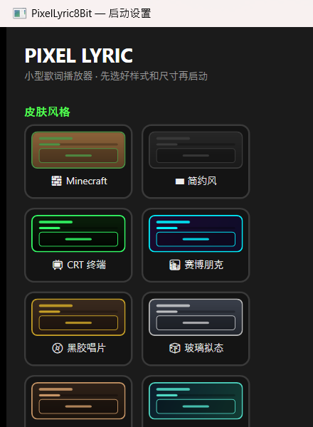

# Pixel Lyric

一个 Windows 桌面小型歌词播放器（歌词浮窗）。跟随系统当前正在播放的媒体（Spotify、网易云音乐、浏览器播放等，只要接入了 Windows 系统媒体控制 SMTC 的都支持），自动抓取并实时同步显示歌词，支持 13 套可切换的像素/复古风格皮肤。



## 功能

- **实时歌词同步**：不依赖轮询系统 API，而是订阅 `TimelinePropertiesChanged` / `PlaybackInfoChanged` 事件打时间锚点，本地插值计算当前播放位置，准确且几乎不耗资源。
- **多引擎免费歌词源**：同时向 [LRCLIB](https://lrclib.net)、网易云音乐、QQ音乐、酷狗音乐并发请求，谁先返回有效结果就用谁，切歌到歌词出现的等待时间取决于最快的那一个。
- **13 套皮肤**，启动时或运行中随时可切换：
  - 🧱 Minecraft 像素风（会走路的 Steve + 小树）
  - ▬ 简约风
  - 📺 复古 CRT 终端风（扫描线滚动 + 屏幕闪烁）
  - 🌆 霓虹赛博朋克风（霓虹灯管式闪烁）
  - 💿 黑胶唱片机风（旋转唱片 + 静止唱臂）
  - 🧊 玻璃拟态风（周期性裂开又愈合）
  - ☕ 复古咖啡馆 / lofi 风（热气袅袅上升）
  - 🌙 极光雪夜风（流动极光 + 飘雪）
  - 🌧️ 雨夜窗景风（雨滴沿窗滑落）
  - ✨ 星空太空风（满天星星不同步闪烁）
  - 🏕️ 篝火露营风（火苗闪烁 + 飘散火星）
  - 🌸 樱花风（花瓣飘落摇曳）
  - 📼 复古磁带机风（双卷盘转动的走带效果）
- **窗口尺寸预设**（小 / 中 / 大），选定后锁定大小，不会被误拖成全屏。
- **显示模式**：标准（标题 + 进度条 + 歌词）或极简（只显示当前歌词）。
- 所有像素素材（Steve、小树、泥土纹理等）都是运行时用代码逐像素生成的 `WriteableBitmap`，不依赖任何外部图片文件。

## 运行要求

- Windows 10 1809 (build 17763) 或更高版本（需要系统媒体控制 SMTC 支持）
- [.NET 8 SDK](https://dotnet.microsoft.com/download) （从源码构建/运行需要；后续会提供免安装 .NET 的独立安装包）

## 从源码运行

```bash
git clone https://github.com/<your-username>/PixelLyric8Bit.git
cd PixelLyric8Bit/PixelLyric8BitFix
dotnet run
```

程序会先弹出启动设置页，选好皮肤 / 尺寸 / 显示模式后点"开始播放"即可。主窗口右上角的齿轮图标（或右键菜单）可以随时回到设置页更换皮肤。

## 项目结构

```
PixelLyric8BitFix/
├── MainWindow.xaml(.cs)   主播放器窗口：歌词同步、多引擎抓词、皮肤渲染
├── SettingsWindow.xaml(.cs) 启动设置页：皮肤/尺寸/显示模式选择
├── AppSettings.cs         本地配置的读写与枚举定义
└── PixelArt.cs            运行时生成像素素材（Steve、小树、篝火、咖啡杯等）
```

## 免责声明

网易云音乐 / QQ音乐 / 酷狗音乐的歌词接口均为非官方接口，仅供个人学习使用，接口结构可能随时变化；LRCLIB 是完全开放的免费歌词数据库。

## License

[MIT](LICENSE)
